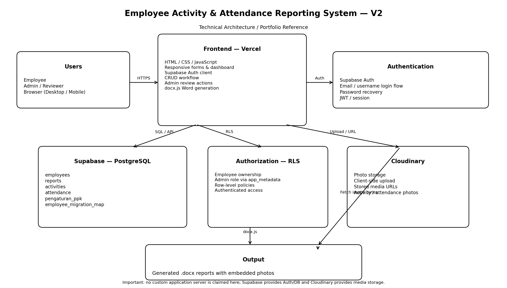

# Employee Activity & Attendance Reporting System — V2

A real administrative workflow application that converts a manual monthly activity/attendance reporting process into a structured web application.

## Live application

**https://laporan-kegiatan-kanri.vercel.app**

## What this project demonstrates

- HTML, CSS, JavaScript
- Supabase Auth
- Supabase PostgreSQL
- Row Level Security (RLS)
- Cloudinary media storage
- CRUD workflows
- Admin dashboard
- Approve / Revision workflow
- Automated `.docx` generation with `docx.js`
- Git/GitHub and Vercel deployment

## Problem

The original process required employees to submit activity and attendance evidence through spreadsheets/files, after which an administrator manually collected photos, organized employee data, prepared reports, and generated printable documents.

## Solution

This application provides:

1. Employee authentication
2. Monthly report records
3. Activity entry and photo upload
4. Attendance entry and photo upload
5. Admin dashboard
6. Submit / review workflow
7. Approve / Revision
8. Automated Word report generation

## Repository structure

```text
Laporan-Kegiatan-Kanri/
├── index.html                  # Vercel/GitHub Pages entry point
├── app/
│   ├── app.js                  # Application logic
│   └── styles.css              # Application styling
├── src/
│   ├── index.html              # Source snapshot
│   ├── app.js
│   └── styles.css
├── database/
│   ├── schema.sql
│   └── rls-policies.sql
├── docs/
│   ├── ARCHITECTURE.md
│   ├── DATABASE.md
│   ├── WORKFLOW.md
│   └── RECRUITER_GUIDE.md
├── assets/
│   ├── architecture/
│   └── screenshots/
├── deployment/
│   └── VERCEL.md
├── ARCHITECTURE.md
├── SECURITY.md
└── .gitignore
```

## Architecture



See `docs/ARCHITECTURE.md`.

## Resume traceability

| Resume claim | Where it is demonstrated |
|---|---|
| HTML/CSS/JavaScript | `app/` |
| Supabase/PostgreSQL | `database/` + `app/app.js` |
| Authentication | `app/app.js` |
| RLS / authorization | `database/rls-policies.sql` |
| Cloudinary | photo upload code in `app/app.js` |
| CRUD | reports, activities, attendance |
| Document automation | `docx.js` implementation |
| Business process automation | `docs/WORKFLOW.md` |
| Admin review | Approve / Revision implementation |

## Security

The browser uses only client-side/public credentials intended for browser use. Database security is enforced through Supabase RLS.

Never commit:
- service-role keys
- Cloudinary API secrets
- passwords
- production database dumps
- private employee data

See `SECURITY.md`.

## Technical scope

This project is intentionally described as a practical serverless/business application. It does **not** claim a custom Node.js/Express backend, microservices, or trained AI model.

## Recruiter guide

See `docs/RECRUITER_GUIDE.md` for a direct map between the CV claims and the implementation.
